# PreventionControl
消防管理系统 亮点：Echarts数据可视化、消防设备全流程管理、周期巡检与任务跟踪、 隐患处置闭环、任务与事件通知； 角色：巡查员、消防员、管理员；

所有源码均本人开发，项目是前后端分离的，所有的项目都具备了完整的业务逻辑，不仅仅局限于基础的增删改查（CRUD）操作，系统亮点众多。

本文注重于计算机毕业设计选题指导，列出题目均有源码， 大家可以去【公众号】(毕业终点站)获取或者加我【qq】(2112698948)提意见(别忘记Star哟)。备注：git

声明：仅用于学习使用，请勿用于任何商业行为！

1.系统非商用，非开源，非无偿。

2.由本人开发，如需源码，请联系以下方式，qq:2112698948。

3.项目有很多，并未全部上传，如果未找到想要的，可直接咨询。

# D6027 · 消防管理系统

> 本项目仅用于学习交流。文档展示 18 张截图，需要了解更多，请联系我。

## 项目简介

消防管理系统是一套面向消防设备与隐患事件日常管理的综合平台，采用 **前后端分离 + 多角色权限** 架构，围绕管理员、消防员与巡查员三类角色划分业务权限，对应设备审核、巡检执行与事件处置的分工协作。

平台把设备、巡检、隐患三条主线串成一条完整链路：巡查员负责消防设备查看、火警隐患事件上报、巡检任务执行与巡检记录填写；消防员承担设备维保记录维护、隐患事件处置与处置结果留证；管理员统筹区域管理、设备审核入库、维保与处置记录查阅、巡检计划编排、任务跟踪以及数据分析。

在数据化与流程化方面，系统通过 ECharts 数据看板展示设备、巡检和事件概况，结合巡检完成率、设备故障率及人员工作量统计辅助管理决策；巡检支持日检、周检、月检及临时安排，含人员分配、进度跟踪、现场照片上传与结果审核；隐患处置贯通上报、事件分配、消防员处置与管理员结案审核，并保留现场照片与历史记录；同时提供巡检任务与火警隐患的消息通知，支持消息查看与已读管理，帮助工作人员及时掌握待办事项。

## 技术架构

| 类别 | 技术选型与说明 |
| :--- | :--- |
| 架构 | B/S、MVC、前后端分离、管理员/消防员/巡查员多角色业务管理 |
| 系统环境 | Windows |
| 开发环境 | IDEA、JDK17、Maven、MySQL、Node.js |
| 后端技术 | Java、Spring Boot 3、Spring MVC、MyBatis-Plus、MySQL、JWT、定时任务 |
| 网页前端 | Vue 3、Vite、Element Plus、Vue Router、Pinia、Axios、ECharts、SCSS |

## 系统亮点

1. **Echarts数据可视化**：通过数据看板展示设备、巡检和事件概况，结合巡检完成率、设备故障率及人员工作量统计，辅助管理决策。

2. **消防设备全流程管理**：覆盖设备录入、审核入库、状态更新与维护保养，支持维保记录追溯和设备台账 Excel 导出。

3. **周期巡检与任务跟踪**：支持日检、周检、月检及临时巡检安排，实现人员分配、进度跟踪、现场照片上传与巡检结果审核。

4. **隐患处置完整链路**：贯通隐患上报、事件分配、消防员处置与管理员结案审核，支持现场照片留证和历史处置记录查询。

5. **任务与事件通知**：提供巡检任务和火警隐患消息通知，支持消息查看与已读管理，帮助工作人员及时掌握待办事项。

6. **多角色协同管理**：围绕管理员、消防员和巡查员划分业务权限，实现设备审核、巡检执行与事件处置的分工协作。

## 系统截图

> 截图存放于仓库 `images/` 目录，不依赖外部图床。

### 平台总览

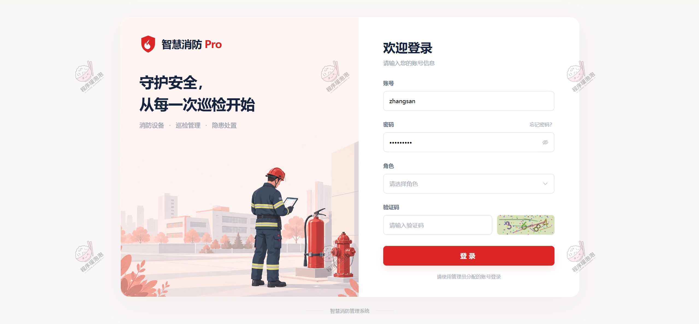

**图 1 · 平台总览**

### 巡查员端

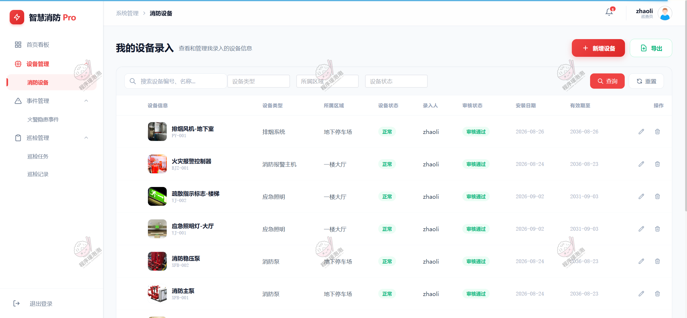

**图 2 · 消防设备**

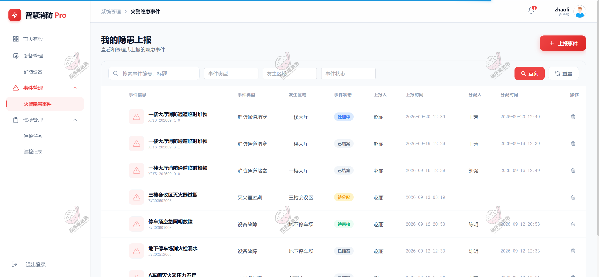

**图 3 · 火警隐患事件**

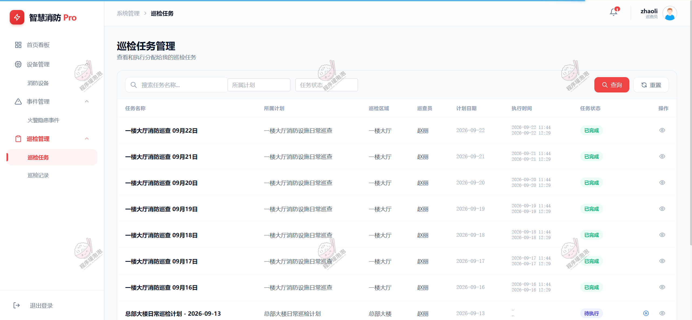

**图 4 · 巡检任务**

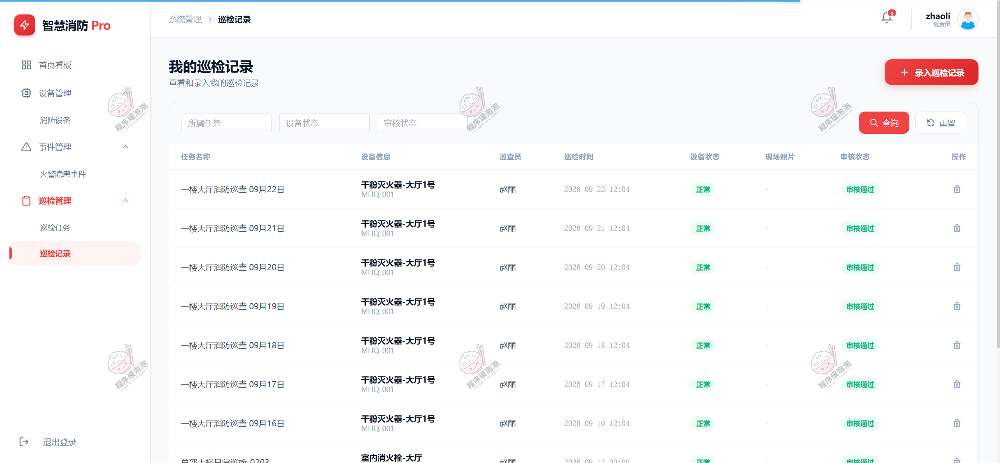

**图 5 · 巡检记录**

### 消防员端

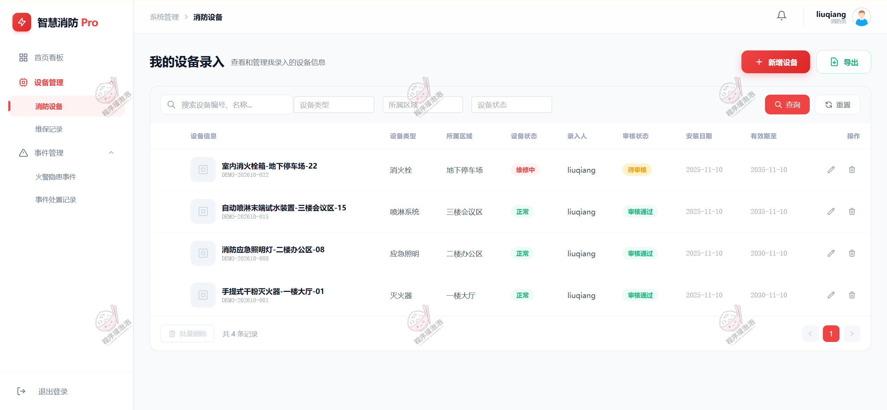

**图 6 · 消防设备**

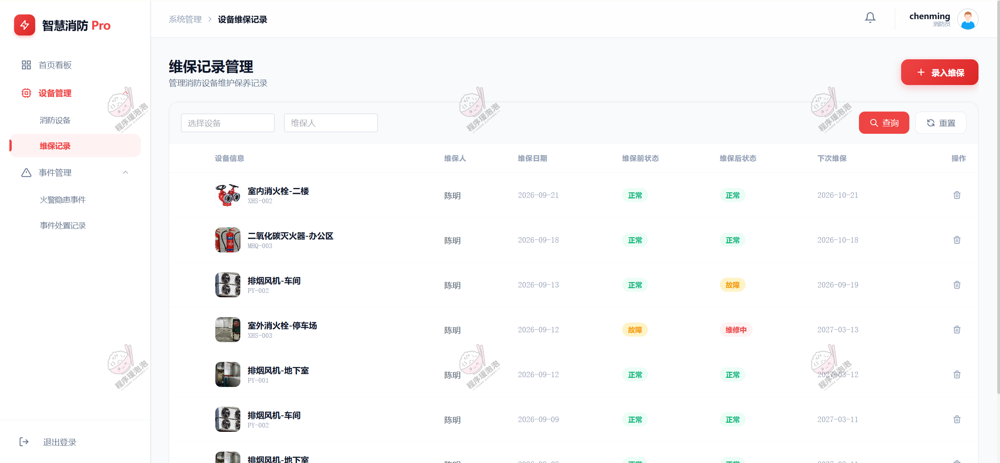

**图 7 · 维保记录**

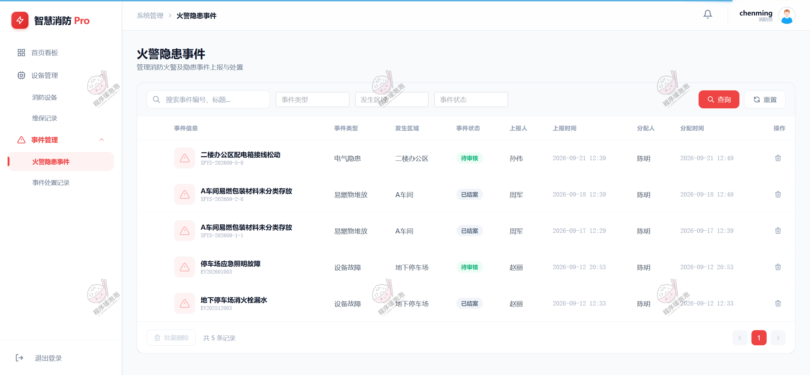

**图 8 · 火警隐患事件**

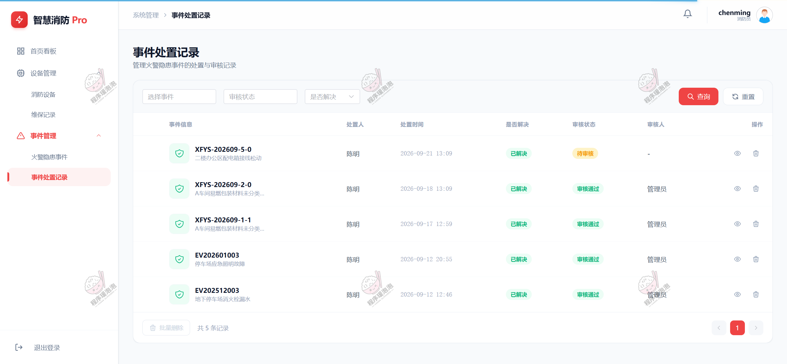

**图 9 · 事件处置记录**

### 管理员端

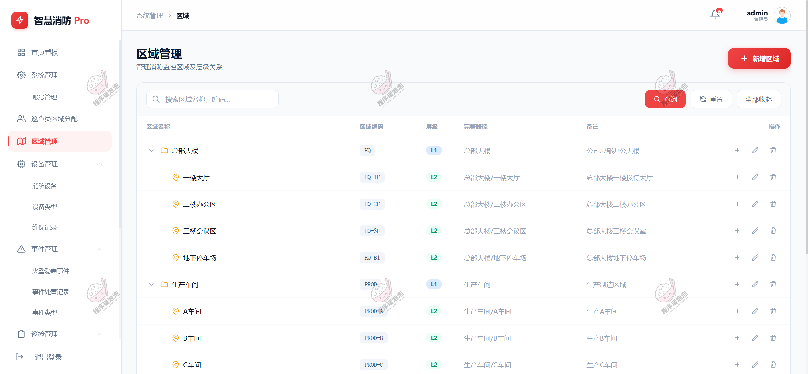

**图 10 · 区域管理**

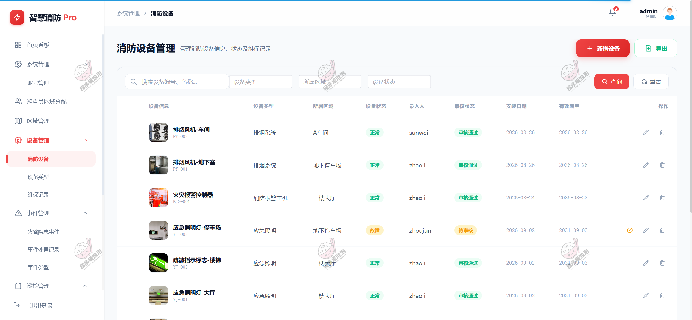

**图 11 · 消防设备**

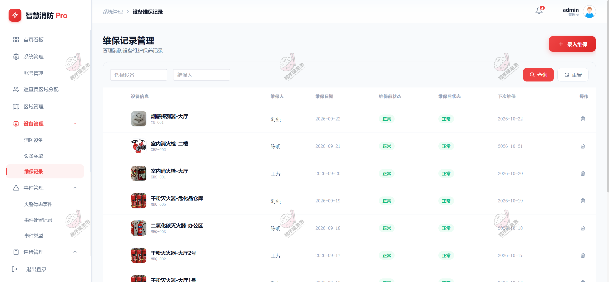

**图 12 · 维保记录**

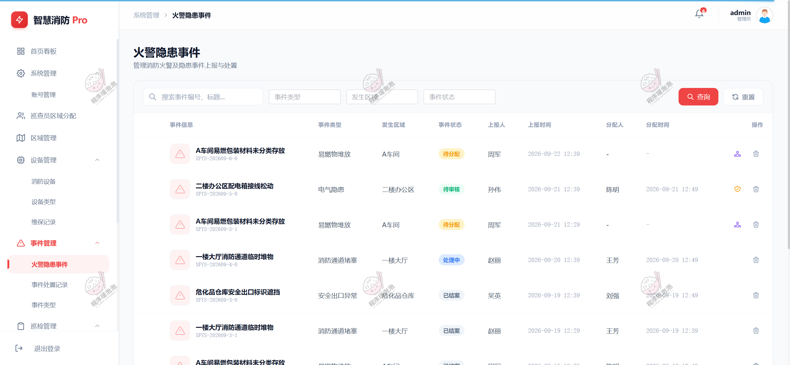

**图 13 · 火警隐患事件**

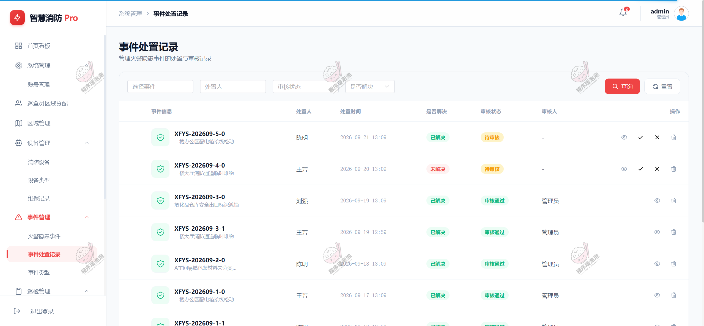

**图 14 · 事件处置记录**

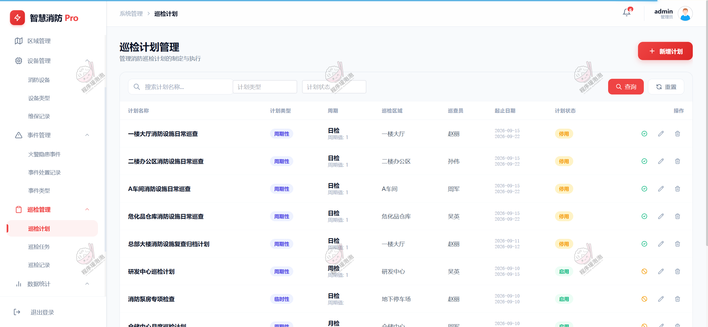

**图 15 · 巡检计划**

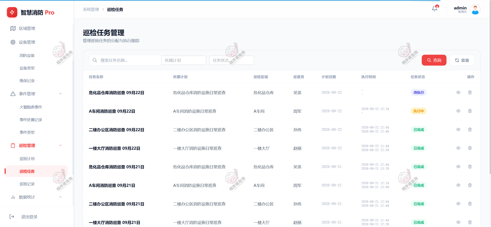

**图 16 · 巡检任务**

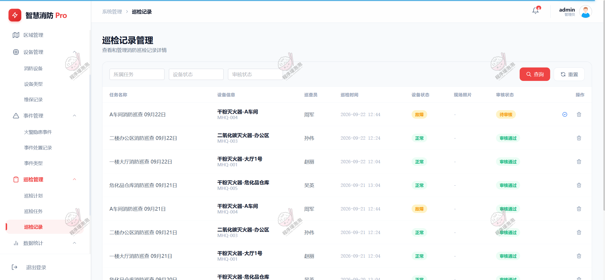

**图 17 · 巡检记录**

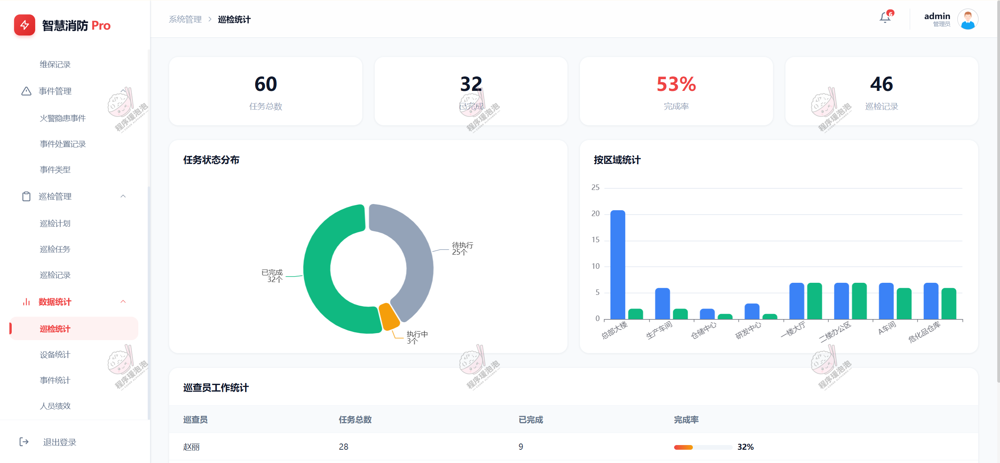

**图 18 · 数据分析**

---

**说明**：以上截图为系统部分功能演示页面，不同账号角色登录后可见菜单有所差异。

本项目仅用于学习交流，非商用、非开源、非无偿。

文档展示 18 张截图，需要了解更多，请联系我。
